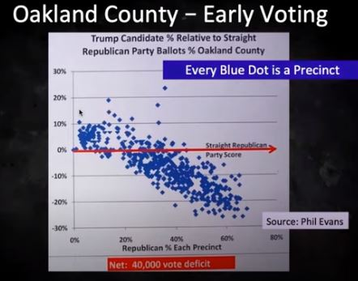
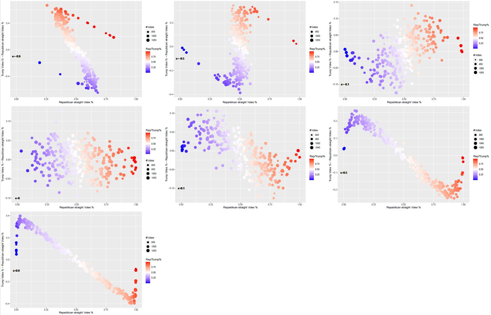

# My thoughts on Michigan Votes Analysis done by MIT PhD
2020-11-13
Disclamer: I am not a citizen nor a greencard holder when I am writing this. I only want to comment on the method and conclusion about this analysis. Bricks and rotton eggs are welcome!

## Background:
2020 US election was significant. Biden team seems to be winning and Trump team claims that Biden team cheated. A group of data scientists from MIT looked at voting data from Michigan states and showed that votes were taken from Trump and given to Biden by some algorithms. Please see the youtube video here "https://www.youtube.com/watch?v=YRJCB6U-H4E". Briefly, they categorize michigan's votes to 4 types:
1. Republican straight (vote for all republican candidates)
2. Trump individually
3. Democrat straight (vote for all democratic candidates)
4. Biden individually
They looked at each precinct, and count the numbers of above 4 types, lets say the numbers are n1, n2, n3, and n4. Then they calculated 2 ratios
1. r1 = n1 / (n1 + n3)
2. r2 = n2 / (n2 + n4)
Then they plot r1 on x axis, and r2-r1 on y axis. And then they show this pic

They are definitely surprised by the beautiful linear relationship. And they concluded that this cannot be true. So there muct be some algorithm taking votes from Trump to Biden.

## My thoughts
I was surprised too at first glance. But think a little more, I was not so sure. Then I decided to do a simulation. 
Here is what I did for simulation briefly, I randomly assign 300,000 voters to 300 precincts. For each precinct, I randomly pick a proportion for Trump's votes ((n1+n2)/(n1+n2+n3+n4)) from a normal distribution which is designed to be unbiased to either Trump or Biden. For each voter, I will assign he/she to one of above 4 groups based on 3 parameters:
1. Trump's votes proportion of that precinct
2. Prior proportion of voters to do straight vote for either Republican or Democrats (set to be 20%, my naive guess)
3. A correlation coefficient (-1 =< c <= 1) which indicates how strong the proportion of Trump's votes of given precinct affect proportion of voters to vote straight. If c = c, then in precinct with 90% Trump's votes (deep red community) it will have 20% of Trump voters do straight vote, and also 20% of Biden's voters do straight vote. In precinct with 10% Trump's votes (deep blue community), people will also have 20% chance to vote straight to either Replublican or Democrats. When c > 0, in deep red precinct, trump's voter would be more likely to vote straight while Biden's voter would less likely to vote straight for democrats. Vise versa, in deep blue precinct, Biden voters would be more likely to vote straight while Trump voters would be less likely to vote straight.
After simulation is done, I count these 300,000 votes and plot a similar plot but with different c.
The results are following:
 
 From top-left to buttom-right, there are 7 plots with c values -0.9, -0.5, -0.1, 0, 0.1, 0.5, 0.9. When c = 0 (2nd row, 1st col), there is no trend between x and y, which is expected by the authors of above mentioned analysis. However, if there is any positive correlation between color of the precinct and proportion of voters do straight voting, we observed the negative correlation observed by above video and claimed as artifacts. Thus, I believe that there is possibility that we could observe the declining linear relationship without any artifacts, if in deep blue precinct higher proportion of Biden voters vote straight for democrats than the proportion of Trump voters vote for republican straight.

## Final words
The conclusion of above mentioned Youtube video was based on the assumption that, proportion of voters voting straight for either republican or democrats is independent of the color of the precinct (more precisely, proportion of Trump voters). However, I did not get any data showing this assumption holds in the video or I missed it. Thus, I think it is a little hasty to say the observed negative linear relationship is an artifacts.

Thank you for readying. You are welcome to check the code :)